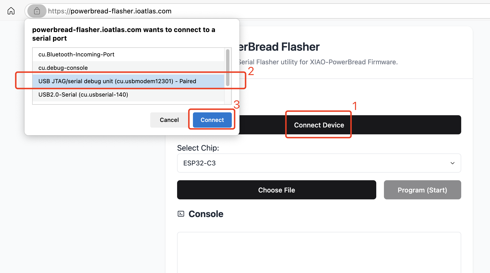
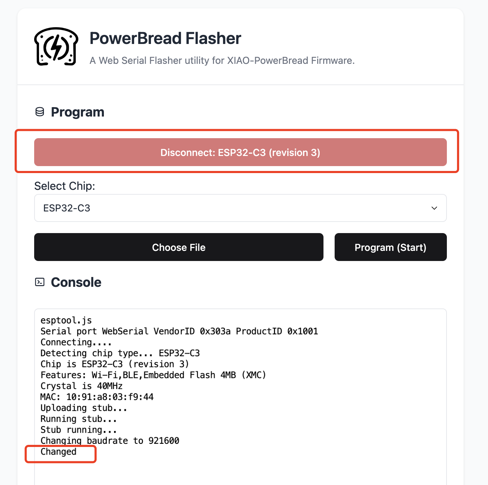
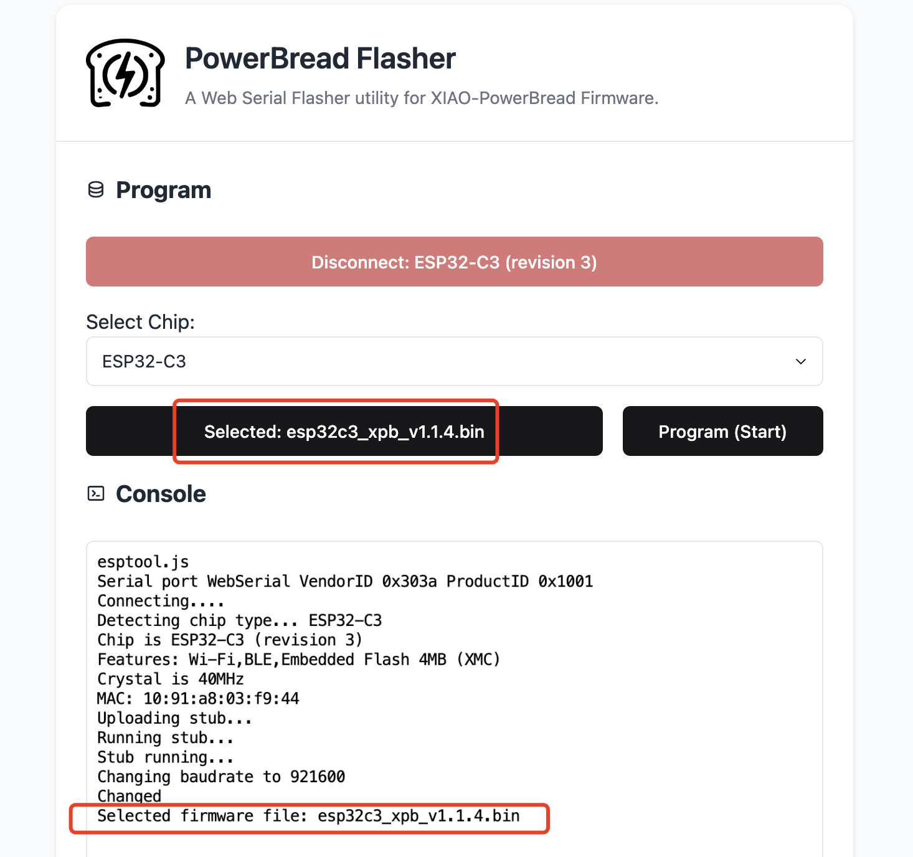
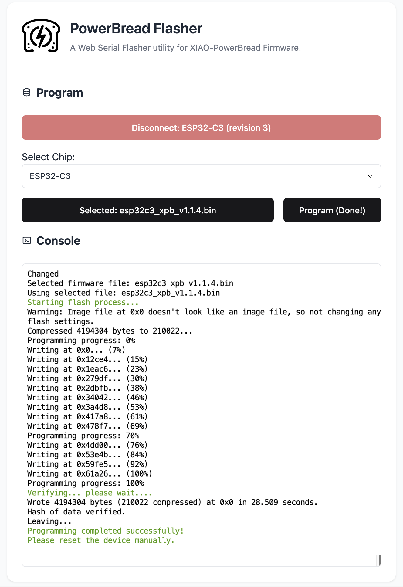

# Flash Firmware for XIAO - ESP32S3/C3/C6

Since the XIAO - ESP32 series (S3/C3/C6) didn't not comes with the UF2 bootloader like the XIAO - RP2040/RP2350,so the way of flashing the firmware is different. Here is 2 methods to flash the firmware for XIAO - ESP32 series.

## Method 1: Using Web based ESP online flash tool (Recommended)
Here I make a web based tool for flashing the firmware to XIAO - ESP32 series, no additional software is needed, just open the web page and upload the firmware.

Steps:
1. Go to release page to download the latest firmware: https://github.com/nicho810/XIAO-PowerBread/releases/latest
2. Download the firmware that fit your board, for example, if you have XIAO ESP32-C3, download the `esp32c3_xpb_vx.x.x.bin`
3. Open the web page: https://powerbread-flasher.ioatlas.com/
4. Select the port for XIAO ESP32 series

5. Make sure the port is connected, it should looks like this:

> if it is failed to connect the port, please try to hold down the **BOOT button** on the XIAO ESP32 series board, holding it and press the **RESET button**, then release both buttons, then refresh the web page and try again with step 4.

6. Click the "Choose File" button to select the firmware you downloaded, it should looks like this:

7. Click "Program" button, and wait for the success message in the console, it should looks like this:

8. Reset the board by pressing the **RESET button** on the XIAO ESP32 series board, and the firmware should run successfully.

## Method 2: Using Arduino IDE

This method is more complicated than the web based tool, but it is a traditional way to flash the firmware and it should works stable with native support of esptool provided by Arduino IDE.

Please make sure the following prerequisites are met:
- Arduino IDE installed
- ESP32 core for Arduino installed (see https://github.com/espressif/arduino-esp32 for details)
- All dependencies installed (see README.md for details)

