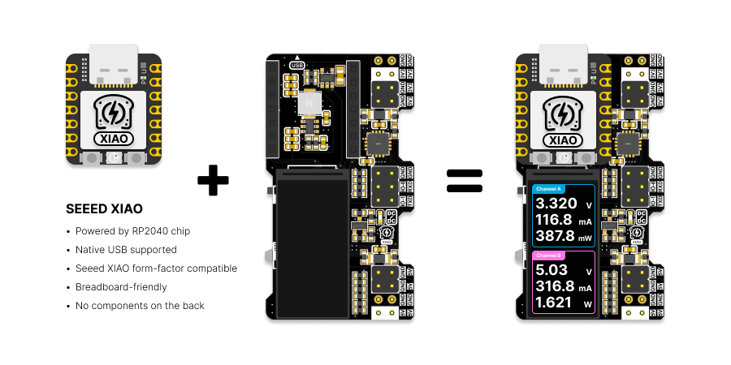
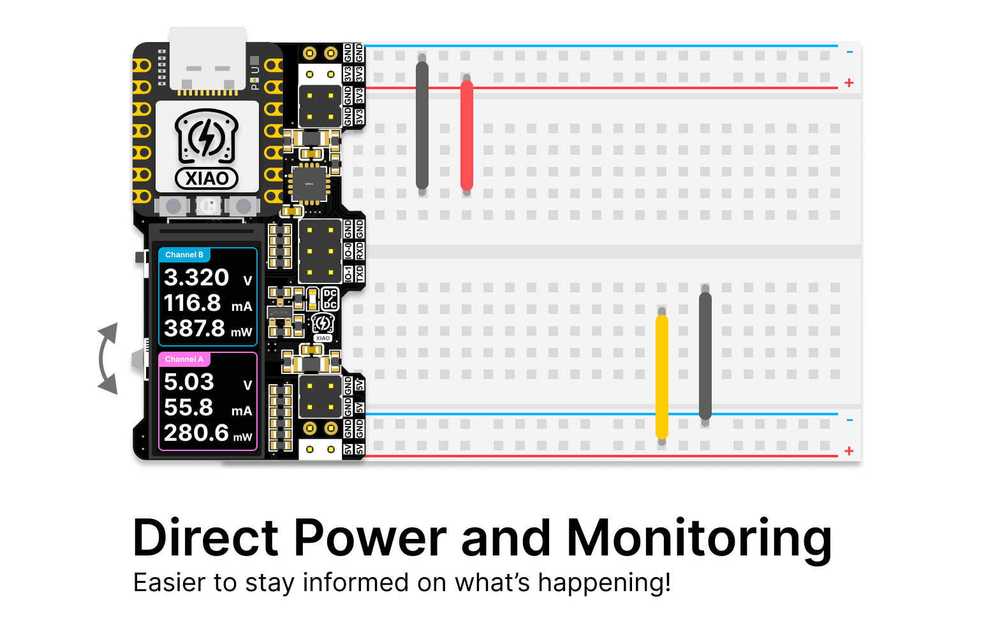
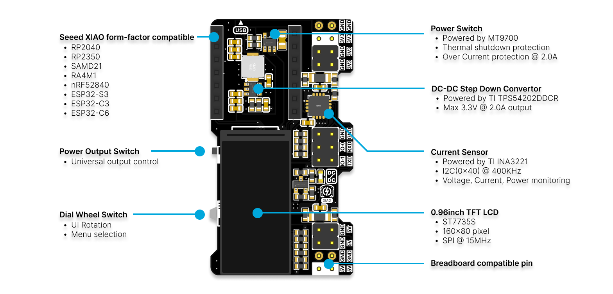

# XIAO PowerBread - A Breadboard Power Supply with Real-Time Monitoring

**XIAO PowerBread** is an open-source hardware project designed to offer a reliable and efficient power solution for breadboard prototyping. Featuring built-in sensors, real-time monitoring, and the RP2040 microcontroller, PowerBread makes powering and developing electronics projects easier than ever.

## Key Features

1. **Real-Time Monitoring**: View essential power metrics at a glance—no multimeter needed. The built-in display shows real-time voltage, current, and power data.
2. **High-Current Output**: Deliver up to 1.5A of stable 3.3V power, ideal for most breadboard-based electronics projects.
3. **Built-in LCD Display**: Stay informed with real-time feedback—critical power data is displayed clearly on the integrated LCD.
4. **Plug-and-Play Design**: Compatible with standard breadboards, simply plug in, power up, and start prototyping without extra setup.
5. **Open-Source and RP2040 Powered**: Powered by the RP2040, this open-source design provides flexibility for future extensions like USB-serial communication and PWM control.
6. **Dual-Channel Voltage and Current Sensing**: Equipped with the INA3221 sensor for dual-channel voltage and current monitoring—know what’s happening with every aspect of your power supply.
7. **Compact Powerhouse**: This compact design delivers both 3.3V and 5V outputs, optimizing your breadboard space without compromising on power.

## Hardware Specifications

- **Input Voltage**: Powered via USB-C through the XIAO.
- **Output Voltages**: Provides 5V and 3.3V outputs, with a maximum current of 1.5A for the 3.3V rail.
- **Current Sensing**: The built-in INA3221 sensor measures voltage, current, and power for real-time display.
- **Microcontroller**: Driven by the RP2040, handling sensor data, display control, and enabling future features like USB-serial communication and PWM generation.
- **Display**: LCD screen for real-time power monitoring.
- **PCB Dimensions**: Designed for seamless integration with standard breadboards while minimizing space usage.

## Getting Started

### Hardware

- **XIAO Board**: The XIAO RP2040 is recommended, though other XIAO boards should work as well.
- **XIAO PowerBread Board**: Clone or remix the design from this repository. (Future hardware may also be available on Tindie if needed.)
- **Breadboard**: Fits standard breadboards for easy prototyping.
- **Power Supply**: Use a standard USB power source.

### Software

- **Arduino Code**: Modify or remix the project using the provided Arduino source code.
  - This code is built on top of freeRTOS from the Arduino Pico SDK. It has 4 tasks:
    - Task for reading current sensors (INA3221).
    - Task for reading dial value from A2 pin of XIAO.
    - Task for updating data to LCD.
    - Task for handling dial functions, such as changing the rotation of the UI.

- **Bin File**: For XIAO RP2040 users, download the precompiled bin file and flash it via UF2 for quick setup.

### Planned Software Features
- [x] Real-time current sensor data displayed on the LCD.
- [x] Dial wheel to adjust the UI for different viewing angles.
- [ ] Line chart mode to visualize power usage for each channel.
- [ ] USB-Serial mode for data transfer.
- [ ] PWM output on IO0 and IO1.
- [ ] ADC reading from IO0 and IO1.

### Libraries Used
- [INA3221_RT Library](https://github.com/RobTillaart/INA3221_RT/tree/master)
- [Adafruit GFX Library](https://github.com/adafruit/Adafruit-GFX-Library)
- [Adafruit ST7735 Library](https://github.com/adafruit/Adafruit-ST7735-Library)
- [Arduino-Pico Core (4.0.x)](https://github.com/earlephilhower/arduino-pico)

## Contributing

Contributions are welcome to improve the XIAO PowerBread project! Whether you want to submit a pull request, propose new features, or report a bug, feel free to use the issue tracker.

## License

This project is licensed under the MIT License. See the [LICENSE](./LICENSE) file for details.
