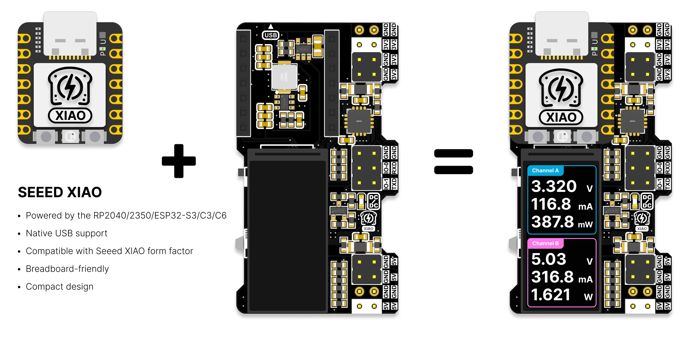
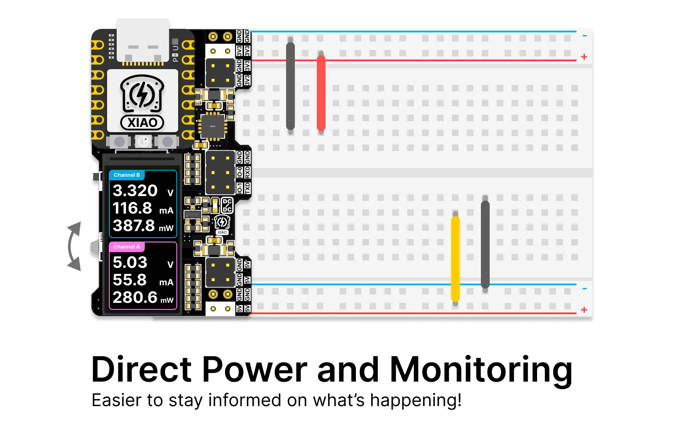
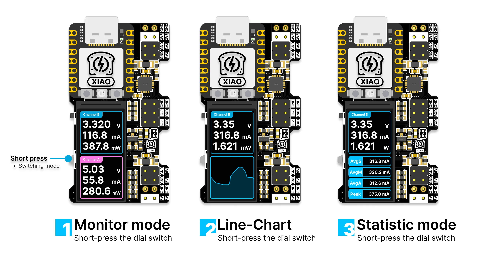
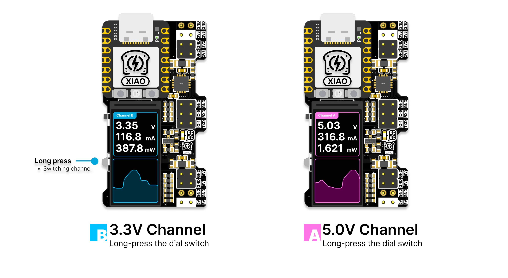
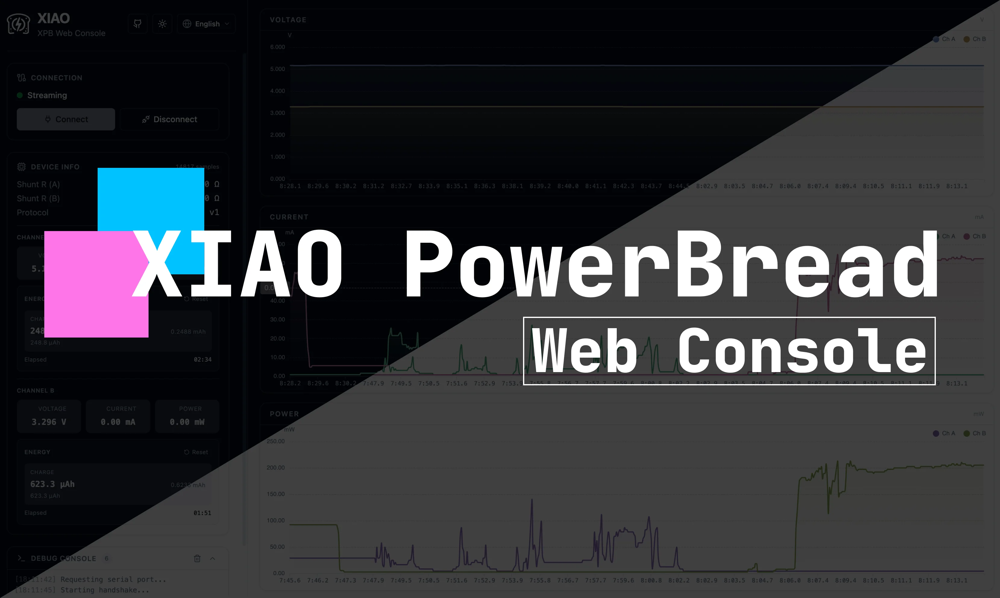
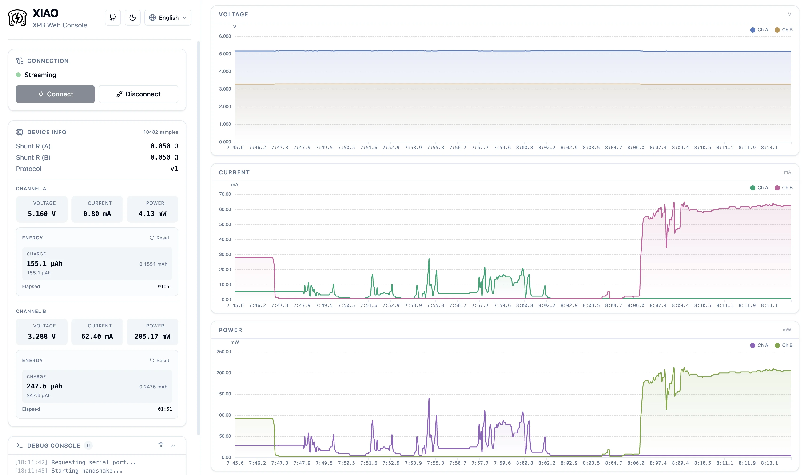
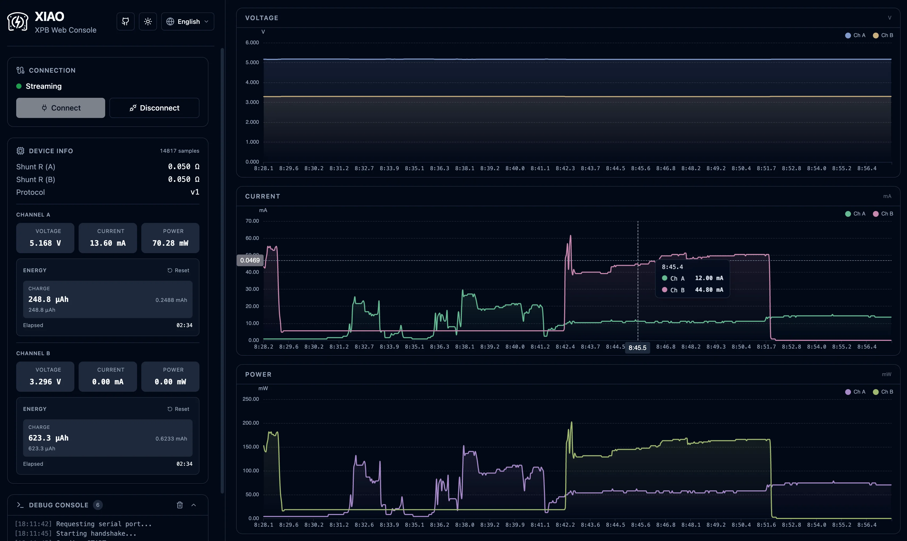
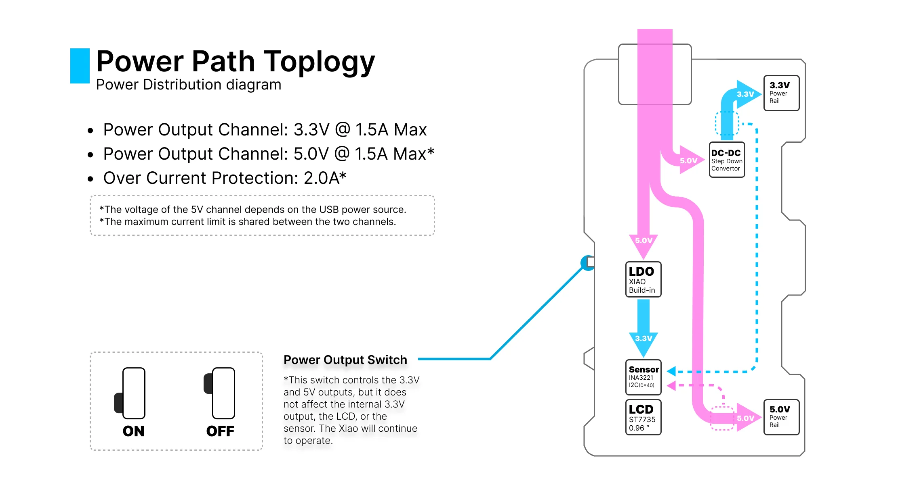
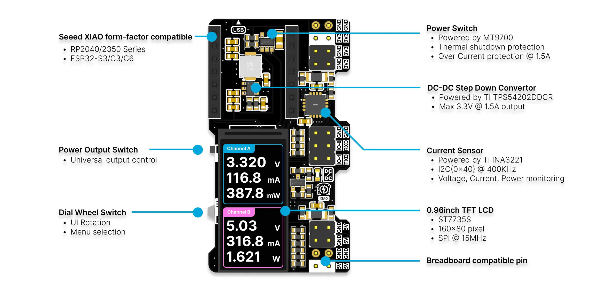

# XIAO PowerBread - A Breadboard Power Supply with Real-Time Monitoring

English | [Deutsch](README_DE.md) | [Français](README_FR.md) | [日本語](README_JP.md)

**XIAO PowerBread** is an open-source hardware project designed to offer a reliable and efficient power solution for breadboard prototyping. Featuring built-in sensors, real-time monitoring, and compatibility with [Seeed Studio XIAO microcontrollers](https://www.seeedstudio.com/xiao-series-page), PowerBread makes powering and developing electronics projects easier than ever.

> Easy installation and compact design

> Direct power and monitoring you breadboard projects

## What's New in v3.0

- **Web Console** — Stream live voltage, current, power, and energy into the browser over USB-Serial (no driver, no install).
- **XPB Binary Protocol v1.2** — Deterministic 100 Hz streaming protocol with a three-stage handshake and automatic reconnect.
- **FreeRTOS Refactor** — Sensor sampling, UI rendering, dial input, and serial streaming run as independent tasks with explicit synchronization.
- **LVGL 8.3 + LovyanGFX** — Smoother rendering on the on-board ST7735 LCD.

> [!IMPORTANT]
> **v3.0 firmware currently supports only XIAO ESP32-S3 and XIAO ESP32-C3.**
> The RP2040 / RP2350 ports still expose a FreeRTOS scheduling bug that has not been root-caused yet. If you are running a XIAO RP2040 or RP2350, please stay on the **v2.0.1** firmware until the v3.x port lands. See the [Firmware Releases](#firmware-releases) table below.

## Key Features

1. **Real-Time Monitoring**: View essential power metrics at a glance—no multimeter needed. The built-in display shows real-time voltage, current, and power data.
2. **High-Current Output**: Deliver up to 1.5A of 3.3V power, ideal for most breadboard-based electronics projects.
3. **Built-in LCD Display**: Stay informed with real-time feedback—critical power data is displayed clearly on the integrated LCD.
4. **Web Console (v3.0)**: Stream sensor data to a browser-based dashboard over USB-Serial with no extra software to install.
5. **Plug-and-Play Design**: Compatible with standard breadboards, simply plug in, power up, and start prototyping without extra setup.
6. **Open-Source and Seeed Studio XIAO Compatibility**: Compatible with most XIAO Dev Boards. This open-source design provides flexibility for future extensions like USB-serial communication and PWM control.
7. **Dual-Channel Voltage and Current Sensing**: Equipped with the INA3221 sensor for dual-channel voltage and current monitoring—know what's happening with every aspect of your power supply.
8. **Compact Powerhouse**: This compact design delivers both 3.3V and 5V outputs, optimizing your breadboard space without compromising on power.
9. **Multiple UI Modes**: The on-device UI can switch between data monitor, line chart, and statistics modes.

> Multiple UI functions

> Long press the dial to switch channels in chart and statistic mode

## Web Console

The **XPB Web Console** is a companion browser app that turns your XIAO PowerBread into a full power-analysis workstation. Plug the board into any Chromium-based browser, click **Connect**, and the firmware starts streaming live measurements over the Web Serial API — no drivers, no installs, no backend.

### Highlights

- **Live charts** for voltage, current, and power on both channels, sampled at 100 Hz.
- **Per-channel energy integration** (mAh / mWh) with a one-click reset.
- **Three-stage handshake** that auto-detects the device, negotiates the protocol, and starts streaming.
- **Dark / Light theme** with persistent settings.
- **Debug console** that shows the raw protocol frames for troubleshooting.

### Screenshots

<table>
  <tr>
    <td align="center">
       
      <b>Light mode</b>
    </td>
    <td align="center">
       
      <b>Dark mode</b>
    </td>
  </tr>
</table>

### Browser Requirements

The Web Console relies on the **Web Serial API**, which is supported in Chromium-based browsers:

- Chrome 89+
- Edge 89+
- Opera 76+

Firefox and Safari do not currently expose the Web Serial API.

### Access

Open the Web Console directly in your browser: **<https://xiao-power-console-web.ioatlas.com>**

The Web Console itself is **not open source** — only the firmware side of the protocol (XPB Binary Protocol v1.2) is published in this repository.

## Hardware Specifications

- **Input Voltage**: Powered via USB-C through the Seeed Studio XIAO.
- **Output Voltages**: Provides 5V and 3.3V outputs, with a maximum current of 1.5A for the 3.3V rail.
- **Current Sensing**: The built-in INA3221 sensor measures voltage, current, and power for real-time display.
- **Microcontroller**: One of the supported Seeed Studio XIAO modules — handles sensor acquisition, display rendering, and serial streaming.
- **Display**: 0.96" ST7735 LCD for real-time power monitoring.
- **PCB Dimensions**: Designed for seamless integration with standard breadboards while minimizing space usage.

## Getting Started

### Hardware

- **XIAO Board** — pick one of the supported modules below.
- **XIAO PowerBread Board** — clone or remix from this repository, or buy the assembled hardware from [Seeed Studio](https://www.seeedstudio.com/XIAO-PowerBread-p-6318.html) or [Tindie](https://www.tindie.com/products/35842/).
- **Breadboard** — fits any standard breadboard.
- **Power Supply** — any standard USB-C source.

#### Supported XIAO Boards & Firmware

| XIAO Board | v3.x | v2.0.1 | v1.1.4 | Recommended Firmware |
|---|---|---|---|---|
| [XIAO ESP32-S3](https://www.seeedstudio.com/XIAO-ESP32S3-p-5627.html) | ✅ | ✅ | ✅ | **v3.0** |
| [XIAO ESP32-C3](https://www.seeedstudio.com/Seeed-XIAO-ESP32C3-p-5431.html) | ✅ | ✅ | ✅ | **v3.0** |
| [XIAO RP2040](https://www.seeedstudio.com/XIAO-RP2040-v1-0-p-5026.html) | ❌ (WIP) | ✅ | ✅ | **v2.0.1** |
| [XIAO RP2350](https://www.seeedstudio.com/Seeed-XIAO-RP2350-p-5944.html) | ❌ (WIP) | ✅ | ✅ | **v2.0.1** |
| [XIAO ESP32-C6](https://www.seeedstudio.com/Seeed-Studio-XIAO-ESP32C6-p-5884.html) | ❌ (WIP) | — | ✅ | **v1.1.4** |

> v3.x support for the RP2040, RP2350, and ESP32-C6 is in progress. The RP-series boards currently expose a FreeRTOS scheduling issue that has not been root-caused; please stay on v2.0.1 until the v3.x port lands.

### Get the Hardware

  <table>
    <tr>
      <td align="center">
        <a href="https://www.seeedstudio.com/XIAO-PowerBread-p-6318.html" target="_blank">
           
          <b>Seeed Studio</b> 
          Get the Kit and XIAO board
        </a>
      </td>
      <td align="center">
        <a href="https://www.tindie.com/products/35842/" target="_blank">
           
          <b>Tindie</b> 
          Get the fully assembled hardware
        </a>
      </td>
    </tr>
  </table>

**Note**: When purchasing from Seeed Studio, remember to also order a compatible XIAO board — it is required but sold separately.

### Software

- **Build from source** — open `Firmware/XPB-Firmware-PlatformIO/` in PlatformIO and select the environment matching your board (`seeed_xiao_esp32s3`, `seeed_xiao_esp32c3`, etc.).
- **Flash a pre-built firmware**:
  - **XIAO ESP32-S3 / ESP32-C3 (v3.x)**
    - Web flash tool: <https://powerbread-flasher.ioatlas.com>
    - Tutorial: [Flash Firmware for XIAO - ESP32 series](Docs/flash-firmware-for-esp32-series.md)
  - **XIAO RP2040 / RP2350 (stay on v2.0.1 for now)**
    1. Download the `.uf2` firmware from the [Release page](https://github.com/nicho810/XIAO-PowerBread/releases/tag/v2.0.1).
    2. Connect the XIAO to your computer with a 4-pin data-capable USB cable.
    3. Enter bootloader mode: hold **BOOT (B)**, tap **RESET (R)**, then release **BOOT**.
    4. A USB drive named `RPI-RP2` will appear.
    5. Drag the `.uf2` onto the drive — the board will reboot into the new firmware.

### Use the Web Console

1. Make sure your board is running v3.x firmware (XIAO ESP32-S3 or ESP32-C3).
2. Open the Web Console at <https://xiao-power-console-web.ioatlas.com> in Chrome / Edge / Opera.
3. Click **Connect**, pick the serial port that corresponds to your XIAO, and grant permission.
4. The firmware switches from text-debug mode to binary streaming as soon as the handshake completes — the charts will start filling in immediately.

### Planned Software Features
- [x] Real-time current sensor data displayed on the LCD.
- [x] Dial wheel to adjust the UI for different viewing angles.
- [x] Line chart mode to visualize power usage for each channel.
- [x] Count mode to count average (second, minute, all-time) and peak current consumption for each channel.
- [x] Save settings to EEPROM.
- [x] Web-based UI for data monitoring (v3.0).
- [x] USB-Serial streaming protocol with handshake & reconnect (v3.0).
- [ ] v3.x port for XIAO RP2040 / RP2350 / ESP32-C6.
- [ ] PWM output on IO0 and IO1.
- [ ] ADC reading from IO0 and IO1.

### Firmware Releases

| Version | Stable | Features | Link |
|---|---|---|---|
| 0.9.0 | Yes | Real-time current sensor data on the LCD. | - |
| 1.0.0 | Yes | Dial wheel to adjust the UI for different viewing angles. | [RP2040](https://github.com/nicho810/XIAO-PowerBread/releases/tag/v1.0.0) |
| 1.1.0 | No  | Line chart mode to visualize power usage. | [RP2040](https://github.com/nicho810/XIAO-PowerBread/releases/tag/v1.1.0) |
| 1.1.1 | Yes | Data-Dashboard, Line-chart, Current-Statistic, Setting. | [RP2040](https://github.com/nicho810/XIAO-PowerBread/releases/tag/v1.1.1) |
| 1.1.2 | Yes | LED blink for debugging. | [RP2040](https://github.com/nicho810/XIAO-PowerBread/releases/tag/v1.1.2) |
| 1.1.3 | Yes | Fixed-scale and auto-scale line-chart. | [RP2040](https://github.com/nicho810/XIAO-PowerBread/releases/tag/v1.1.3) |
| 1.1.4 | Yes | Adds RP2350, ESP32-C3, ESP32-S3, ESP32-C6 support. | [RP2040, RP2350, ESP32C3, ESP32S3, ESP32C6](https://github.com/nicho810/XIAO-PowerBread/releases/tag/v1.1.4) |
| 2.0.0 | Yes | Refactor + switch to LVGL / LovyanGFX rendering. | [RP2040](https://github.com/nicho810/XIAO-PowerBread/releases/tag/v2.0.0) |
| 2.0.1 | Yes 👍 (RP2040 / RP2350) | Adds RP2350, ESP32-C3, ESP32-S3. | [RP2040, RP2350, ESP32C3, ESP32S3](https://github.com/nicho810/XIAO-PowerBread/releases/tag/v2.0.1) |
| **3.0.0** | **Yes 👍 (ESP32-S3 / C3)** | **Web Console, XPB Binary Protocol v1.2, FreeRTOS refactor. ESP32-S3 / C3 only.** | [ESP32S3, ESP32C3](https://github.com/nicho810/XIAO-PowerBread/releases/tag/v3.0.0) |

### Documentation
- [System Config Explanation](Docs/sysConfig.md)
  - Default mode setting
  - Shunt resistor setting (20mOhm, 50mOhm)
  - Serial output setting (Human-readable mode, Arduino plotter mode)
  - Line chart setting (refresh rate)
- [XPB Binary Protocol v1.2](Firmware/XPB-Firmware-PlatformIO/docs/) — handshake, frame layout, STREAMING reconnect semantics.
- [Flash Firmware for ESP32 series](Docs/flash-firmware-for-esp32-series.md)

### Troubleshooting

1. **The display is not responding** — make sure you are on the latest firmware; the latest releases ship stability fixes. Try pressing the reset button on the XIAO.
2. **The display is not working** — check the I2C and SPI pin connections, and verify the XIAO is properly soldered.
3. **The current value is not correct** — check the shunt resistor value and set it correctly in `sysConfig` (e.g. `20` for 20 mΩ, `50` for 50 mΩ). See [System Config](Docs/sysConfig.md).
4. **Both voltage readings show 0 V** — check the power switch; it should be in the **DOWN** position (UP = OFF, DOWN = ON).
5. **Web Console says "Web Serial API not supported"** — use Chrome, Edge, or Opera. Firefox and Safari do not implement Web Serial.
6. **Web Console can connect but no data arrives** — make sure the firmware is v3.x and that no other application (Arduino Serial Monitor, PlatformIO Monitor) is holding the serial port.

### Credits

| Library | v1.x | v2.x | v3.x | Link |
|---|---|---|---|---|
| Arduino-Pico Core | ✅ | ✅ | ✅ | [arduino-pico](https://github.com/earlephilhower/arduino-pico) |
| Arduino-ESP32 Core | ✅ | ✅ | ✅ | [arduino-esp32](https://github.com/espressif/arduino-esp32) |
| INA3221_RT | ✅ | ✅ | ✅ | [INA3221_RT](https://github.com/RobTillaart/INA3221_RT/tree/master) |
| Adafruit GFX | ✅ |  |  | [Adafruit-GFX-Library](https://github.com/adafruit/Adafruit-GFX-Library) |
| Adafruit ST7735 | ✅ |  |  | [Adafruit-ST7735](https://github.com/adafruit/Adafruit-ST7735-Library) |
| Adafruit SleepyDog | ✅ |  |  | [Adafruit_SleepyDog](https://github.com/adafruit/Adafruit_SleepyDog) |
| LovyanGFX |  | ✅ | ✅ | [LovyanGFX](https://github.com/lovyan03/LovyanGFX) |
| LVGL |  | ✅ | ✅ | [LVGL](https://github.com/lvgl/lvgl) |
| FreeRTOS |  |  | ✅ | bundled with Arduino-ESP32 / Arduino-Pico |
| Chart.js (Web Console) |  |  | ✅ | [Chart.js](https://www.chartjs.org/) |

| Tool | Link |
|---|---|
| MergeBin tool for ESP32 series | [Thanks to DavidSchinazi, DunkelRatte](https://github.com/platformio/platform-espressif32/issues/1078#issuecomment-2219671743) |
| XPB Web Console (hosted, not open source) | <https://xiao-power-console-web.ioatlas.com> |

## Contributing

Contributions are welcome! Whether you want to submit a pull request, propose new features, or report a bug, feel free to use the issue tracker. **Help on the v3.x RP2040 / RP2350 FreeRTOS port is especially appreciated** — see the open issues tagged `rp-rtos`.

## License

This project is licensed under the MIT License. See the [LICENSE](./LICENSE) file for details.
