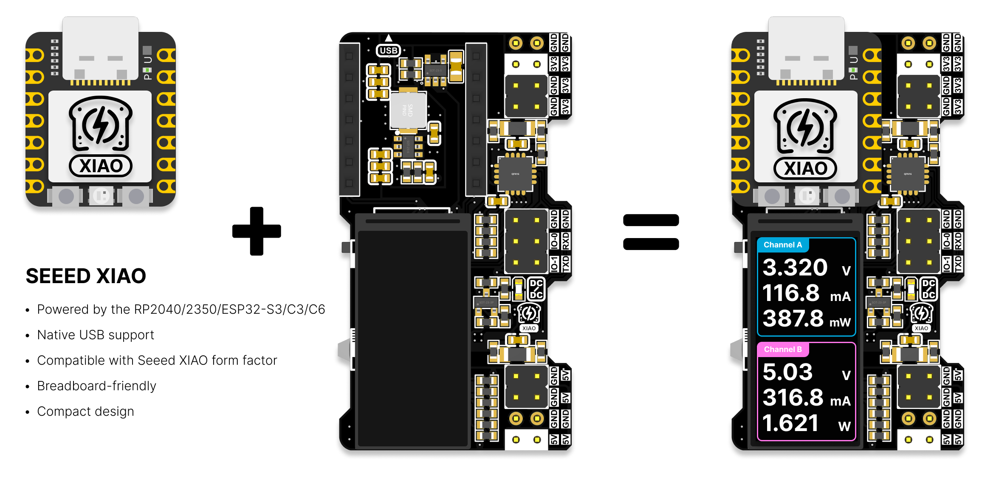
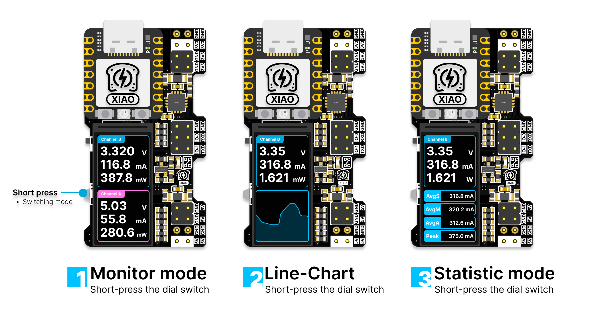
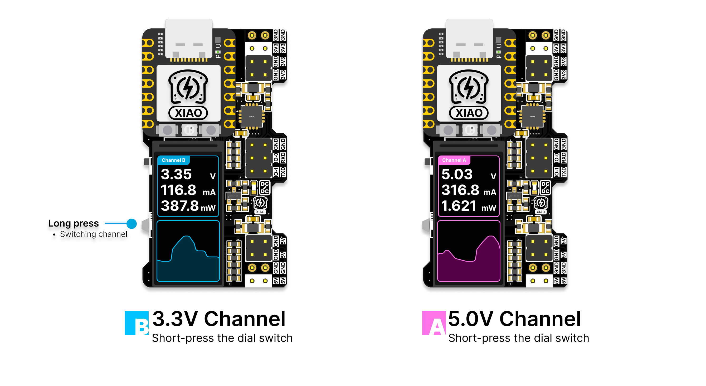
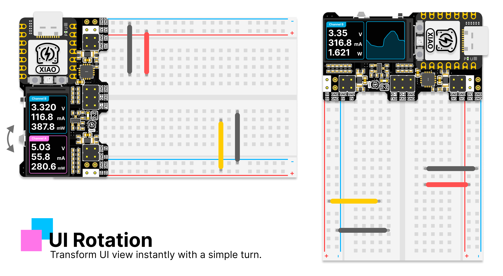
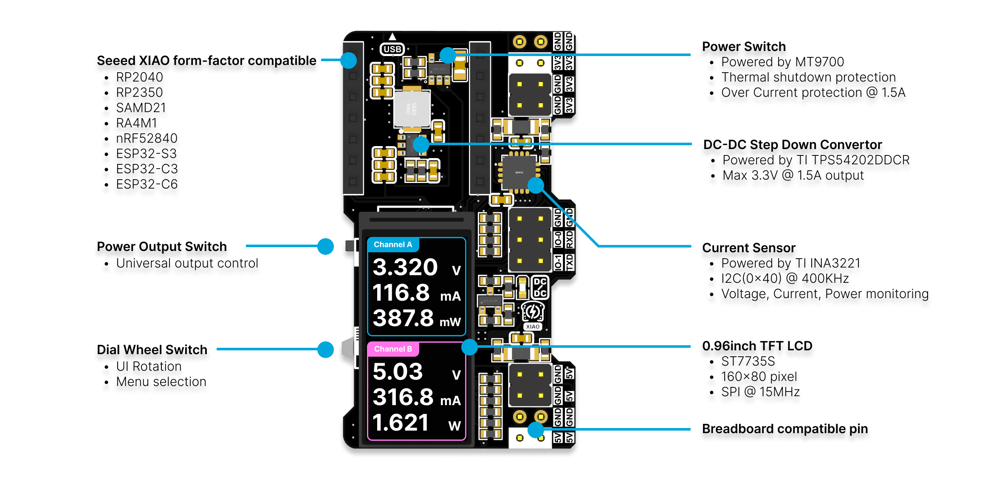
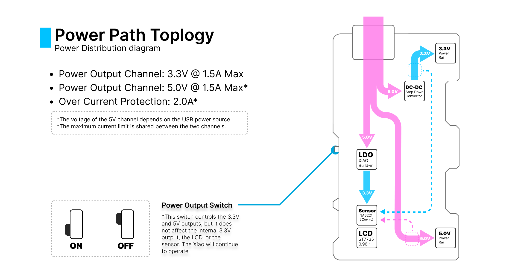

# XIAO PowerBread - Une alimentation pour plaque d'essai avec surveillance en temps réel

[English](README.md) | [Deutsch](README_DE.md) | Français | [日本語](README_JP.md)

**XIAO PowerBread** est un projet de matériel open-source conçu pour offrir une solution d'alimentation fiable et efficace pour le prototypage sur plaque d'essai. Doté de capteurs intégrés, d'une surveillance en temps réel et du microcontrôleur RP2040, PowerBread facilite plus que jamais l'alimentation et le développement de projets électroniques.

> Installation facile et conception compacte

> Alimentation directe et surveillance de vos projets sur plaque d'essai

## Caractéristiques principales

1. **Surveillance en temps réel** : Visualisez les métriques d'alimentation essentielles d'un coup d'œil, sans multimètre. L'écran intégré affiche en temps réel les données de tension, de courant et de puissance.
2. **Sortie à courant élevé** : Fournit jusqu'à 1,5A de puissance en 3,3V, idéal pour la plupart des projets électroniques sur plaque d'essai.
3. **Écran LCD intégré** : Restez informé avec un retour en temps réel - les données d'alimentation critiques sont clairement affichées sur l'écran LCD intégré.
4. **Conception plug-and-play** : Compatible avec les plaques d'essai standard, il suffit de brancher, d'alimenter et de commencer à prototyper sans configuration supplémentaire.
5. **Open-source et alimenté par RP2040** : Alimenté par le RP2040, cette conception open-source offre une flexibilité pour les extensions futures comme la communication USB-série et le contrôle PWM.
6. **Détection de tension et de courant à double canal** : Équipé du capteur INA3221 pour la surveillance de la tension et du courant à double canal - connaissez tous les aspects de votre alimentation.
7. **Centrale électrique compacte** : Cette conception compacte fournit des sorties 3,3V et 5V, optimisant l'espace de votre plaque d'essai sans compromettre la puissance.
8. **Fonctions d'interface utilisateur multiples** : L'interface peut basculer entre la surveillance des données, le graphique linéaire et le mode statistique.

> Fonctions d'interface utilisateur multiples

> Appuyez longuement sur la molette pour changer de canal en mode graphique et statistique

> Tournez la molette pour ajuster l'interface utilisateur selon différents angles de vue

## Spécifications matérielles

- **Tension d'entrée** : Alimenté via USB-C à travers le XIAO.
- **Tensions de sortie** : Fournit des sorties 5V et 3,3V, avec un courant maximum de 1,5A pour le rail 3,3V.
- **Détection de courant** : Le capteur INA3221 intégré mesure la tension, le courant et la puissance pour un affichage en temps réel.
- **Microcontrôleur** : Piloté par le RP2040, gérant les données des capteurs, le contrôle de l'affichage et permettant des fonctionnalités futures comme la communication USB-série et la génération PWM.
- **Affichage** : Écran LCD pour la surveillance de l'alimentation en temps réel.
- **Dimensions du PCB** : Conçu pour une intégration parfaite avec les plaques d'essai standard tout en minimisant l'utilisation de l'espace.

## Pour commencer

### Matériel

- **Carte XIAO** : Le XIAO RP2040 est recommandé, vous pouvez également utiliser : XIAO RP2350, XIAO ESP32-C3, XIAO ESP32-S3, XIAO ESP32-C6. (Assurez-vous de flasher le firmware compatible avec votre type de carte)
- **Carte XIAO PowerBread** : Clonez ou remixez la conception à partir de ce dépôt. Vous pouvez également obtenir le matériel sur [Tindie](https://www.tindie.com/products/35842/).
- **Plaque d'essai** : S'adapte aux plaques d'essai standard pour un prototypage facile.
- **Alimentation** : Utilisez une source d'alimentation USB standard.

### Logiciel

- **Remixer le projet** : Modifiez ou remixez le projet en utilisant le code source Arduino fourni.
- **Utiliser directement le firmware compilé** :
  - Pour les séries XIAO ESP32, il est recommandé d'utiliser l'outil de flash web : https://powerbread-flasher.ioatlas.com/, consultez ce tutoriel pour plus de détails : [Flash du firmware pour les séries XIAO - ESP32](Docs/flash-firmware-for-esp32-series.md)
  - Pour XIAO RP2040/RP2350, il est recommandé d'utiliser la méthode UF2 pour télécharger le firmware.

> Méthode de téléchargement UF2 :
> 1. Téléchargez le fichier firmware compilé depuis la [page des versions](https://github.com/nicho810/XIAO-PowerBread/releases)
> 2. Connectez XIAO au PC/MAC via USB (assurez-vous qu'il s'agit d'un câble USB à 4 broches)
> 3. Appuyez sur le bouton B (Boot) du XIAO et maintenez-le enfoncé, puis appuyez simultanément sur le bouton R (Reset) du XIAO. Relâchez ensuite tous les boutons
> 4. Vous devriez voir un lecteur USB nommé RPI-RP2 sur votre PC/MAC.
> 5. Faites glisser et déposez le fichier firmware (*.uf2) sur le lecteur RPI-RP2, le fichier sera téléchargé sur XIAO.
> 6. Après quelques secondes, le XIAO se réinitialisera et démarrera avec le firmware.

### Fonctionnalités logicielles prévues
- [x] Données du capteur de courant en temps réel affichées sur l'écran LCD.
- [x] Molette pour ajuster l'interface utilisateur selon différents angles de vue.
- [x] Mode graphique linéaire pour visualiser l'utilisation de l'énergie pour chaque canal.
- [x] Mode de comptage pour compter la consommation moyenne (seconde, minute, tout le temps) et de pointe pour chaque canal.
- [x] Permet de sauvegarder les données de paramétrage dans l'EEPROM.
- [ ] Mode USB-Série comme outil de débogage.
- [ ] Sortie PWM sur IO0 et IO1.
- [ ] Lecture ADC depuis IO0 et IO1.

### Versions du firmware

| Version | Stable | Développement | Fonctionnalités ajoutées | Lien |
|---------|--------|---------------|--------------------------|------|
| 0.9.0   | Oui    | Oui           | Données du capteur de courant en temps réel affichées sur l'écran LCD. | - |
| 1.0.0   | Oui    | Oui           | Molette pour ajuster l'interface utilisateur selon différents angles de vue. | [Page des versions](https://github.com/nicho810/XIAO-PowerBread/releases/tag/v1.0.0) |
| 1.1.0   | Non    | Oui           | Mode graphique linéaire pour visualiser l'utilisation de l'énergie pour chaque canal. | [Page des versions](https://github.com/nicho810/XIAO-PowerBread/releases/tag/v1.1.0) |
| 1.1.1   | Oui    | Oui           | Prise en charge du tableau de bord de données, du graphique linéaire, des statistiques de courant, des paramètres | [Page des versions](https://github.com/nicho810/XIAO-PowerBread/releases/tag/v1.1.1) |
| 1.1.2   | Oui    | Oui           | Introduit la fonctionnalité de clignotement LED à des fins de débogage | [Page des versions](https://github.com/nicho810/XIAO-PowerBread/releases/tag/v1.1.2) |
| 1.1.3   | Oui👍   | Oui           | Ajout du support d'échelle fixe et d'échelle automatique pour le graphique linéaire | [Page des versions](https://github.com/nicho810/XIAO-PowerBread/releases/tag/v1.1.3) |
| 1.1.4   | Oui👍   | Oui           | Ajout du support pour XIAO RP2350, XIAO ESP32-C3, XIAO ESP32-S3, XIAO ESP32-C6 | [Page des versions](https://github.com/nicho810/XIAO-PowerBread/releases/tag/v1.1.4) |

### Documentation
- [Explication de la configuration du système](Docs/sysConfig.md)
  - Paramétrage du mode par défaut
  - Paramétrage de la résistance shunt (20mOhm, 50mOhm)
  - Paramétrage de la sortie série (mode lisible par l'homme, mode traceur Arduino)
  - Paramétrage du graphique linéaire (taux de rafraîchissement du graphique)

### Dépannage
1. L'écran ne répond pas
   - Assurez-vous d'utiliser le dernier firmware, le dernier firmware contient des corrections de bugs pour la stabilité.
   - Essayez de réinitialiser le XIAO en appuyant sur le bouton de réinitialisation de la carte XIAO.
2. L'écran ne fonctionne pas
   - Veuillez vérifier les connexions des broches I2C et SPI, et assurez-vous que le XIAO est correctement soudé aux broches.
3. La valeur du courant n'est pas correcte
   - Vérifiez la valeur de la résistance shunt et définissez-la correctement dans la configuration du système. (par exemple, 20 pour 20mOhm, 50 pour 50mOhm) -> [Explication de la configuration du système](Docs/sysConfig.md)
4. Les deux tensions affichées sur l'écran sont de 0V
   - Vérifiez l'interrupteur d'alimentation, il doit être en position basse. (Position HAUTE est OFF, position BASSE est ON)

### Bibliothèques utilisées
- [Bibliothèque INA3221_RT](https://github.com/RobTillaart/INA3221_RT/tree/master)
- [Bibliothèque Adafruit GFX](https://github.com/adafruit/Adafruit-GFX-Library)
- [Bibliothèque Adafruit ST7735](https://github.com/adafruit/Adafruit-ST7735-Library) 
- [Arduino-Pico Core (4.0.x)](https://github.com/earlephilhower/arduino-pico)
- [adafruit sleepydog](https://github.com/adafruit/Adafruit_SleepyDog)
- [Arduino-ESP32 Core (3.x.x)](https://github.com/espressif/arduino-esp32)

> Une version modifiée de la bibliothèque Adafruit_ST7735 est incluse depuis la v1.1.2 pour s'adapter au module LCD utilisé dans ce projet.

## Contribuer

Les contributions sont les bienvenues pour améliorer le projet XIAO PowerBread ! Que vous souhaitiez soumettre une pull request, proposer de nouvelles fonctionnalités ou signaler un bug, n'hésitez pas à utiliser le tracker d'issues.

## Licence

Ce projet est sous licence MIT. Voir le fichier [LICENSE](./LICENSE) pour plus de détails.
